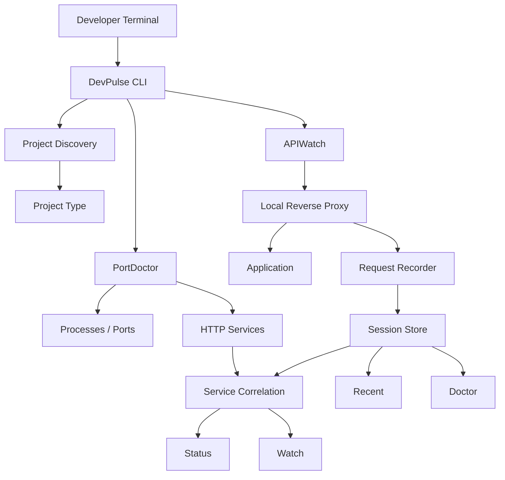

# DevPulse

<div align="center">

### Local Development Observability for the Terminal

**Know what is running. See what is receiving traffic. Find what needs attention.**

[](https://github.com/yatinannam/devpulse/actions/workflows/ci.yml)
[](https://github.com/yatinannam/devpulse/actions/workflows/security.yml)
[](https://github.com/yatinannam/devpulse/actions/workflows/codeql.yml)
[](LICENSE)
[](https://github.com/yatinannam/devpulse/releases)

</div>

---

## What is DevPulse?

DevPulse is a **cross-platform Go CLI for local development observability**.

It combines two ideas into one terminal workflow:

- **PortDoctor** — discovers local listening services, processes, and HTTP-capable endpoints.
- **APIWatch** — captures HTTP traffic through a local reverse proxy and records request-level telemetry.

The result is a small local diagnostic pipeline:

```text
┌──────────────────────────────────────────────────────────┐
│                     LOCAL MACHINE                        │
├──────────────────────────────────────────────────────────┤
│                                                          │
│  processes ──► ports ──► HTTP services ──► endpoints    │
│                                           │              │
│                                           ▼              │
│                                     HTTP traffic         │
│                                           │              │
│                           ┌───────────────┼────────────┐ │
│                           ▼               ▼            ▼ │
│                        status           recent       doctor
│                           │               │            │
│                           └───────────────┼────────────┘ │
│                                           ▼              │
│                                      watch              │
└──────────────────────────────────────────────────────────┘
```

DevPulse is deliberately **local-first**: session data and configuration stay on the developer's machine unless the developer explicitly moves them elsewhere.

---

## Quick Start

Install the binary once, put it on your `PATH`, then initialize the project:

```bash
cd my-project
devpulse init
devpulse traffic
```

After traffic has been captured:

```bash
devpulse status
devpulse recent
devpulse doctor
devpulse watch
```

Need the command reference?

```bash
devpulse
devpulse help
devpulse --help
devpulse -h
```

Version aliases:

```bash
devpulse version
devpulse --version
devpulse -v
```

---

## The Developer Workflow

```text
        ┌───────────────┐
        │  devpulse     │
        │  init         │
        └───────┬───────┘
                │
                ▼
      detect project + target
                │
                ▼
        ┌───────────────┐
        │  devpulse     │
        │  traffic      │
        └───────┬───────┘
                │
                ▼
      local reverse proxy :9090
                │
                ▼
        ┌─────────────────┐
        │   application   │
        └────────┬────────┘
                 │
                 ▼
          session.json
                 │
        ┌────────┼─────────┐
        ▼        ▼         ▼
      status   recent    doctor
        │
        └──────────────► watch
```

The intended experience is:

> **Install once → initialize once → inspect continuously.**

---

## What DevPulse Observes

| Layer | Signal | DevPulse view |
| --- | --- | --- |
| Process | PID / process name | PortDoctor |
| Network | Listening TCP sockets | PortDoctor |
| Service | HTTP reachability | PortDoctor |
| Framework | HTTP/server fingerprints | Discovery |
| Request | Method + URI + status | APIWatch |
| Timing | Request latency | APIWatch |
| Volume | Endpoint request counts | Status |
| Failures | 4xx / 5xx responses | Doctor |
| Repetition | Repeated request patterns | Doctor |
| Live state | Port changes / refresh | Watch |

---

## 🏗 Architecture



### Runtime model

```text
┌──────────────┐       ┌─────────────────────┐
│ PortDoctor   │──────►│                     │
│              │       │ Service Correlation │──────► status/watch
└──────────────┘       │                     │
                       └──────────┬──────────┘
                                  ▲
                                  │
┌──────────────┐       ┌──────────┴──────────┐
│ APIWatch     │──────►│ Session / Endpoints │──────► recent/doctor
│              │       │                     │
└──────────────┘       └─────────────────────┘
```

---

## Command Reference

| Command | Description |
| --- | --- |
| `devpulse init` | Detect the current project and configure a local HTTP target |
| `devpulse ports` | List local listening ports and processes |
| `devpulse ports --watch` | Watch for port additions/removals |
| `devpulse traffic` | Capture HTTP traffic through the local proxy |
| `devpulse status` | Correlate discovered services with captured traffic |
| `devpulse recent` | Show the most recent captured requests |
| `devpulse doctor` | Analyze a captured session for errors and suspicious patterns |
| `devpulse watch` | Continuously refresh local service/traffic state |
| `devpulse config` | Read or update persistent defaults |
| `devpulse version` | Print the current build version |

Every command is intended to expose command-specific flags through:

```bash
devpulse <command> --help
```

---

## APIWatch

APIWatch runs as a local reverse proxy.

Default topology:

```text
client
  │
  ▼
127.0.0.1:9090
  │
  │  DevPulse recorder
  ▼
localhost:3000
```

Default configuration:

```text
listen = :9090
target = http://localhost:3000
session = ~/.devpulse/session.json
```

Example:

```bash
devpulse traffic --target http://localhost:8080 --listen :9090
```

Captured requests are persisted as a versioned JSON session.

---

## PortDoctor

PortDoctor performs platform-specific local socket inspection:

```text
Linux  → ss
Windows → netstat + tasklist
macOS  → lsof
```

The implementation abstracts those platform details behind the same internal service model, so the CLI presents one interface across supported platforms.

HTTP-capable listeners are distinguished from generic TCP listeners through bounded local probing.

---

## Diagnostics

The diagnostic layer currently aggregates:

```text
request count
    +
error count
    +
average latency
    +
slow-request count
    +
endpoint frequency
    +
repeated-request patterns
```

Example mental model:

```text
GET /api/users
├── 184 requests
├── 4 errors
├── 72 ms average
└── 2 repeated-request findings
```

This data model is also the foundation for the next generation of DevPulse analysis: baselines, change detection, anomaly correlation, and local dependency reasoning.

---

## Installation

### Windows

Download the latest Windows archive from [GitHub Releases](https://github.com/yatinannam/devpulse/releases), extract `devpulse.exe`, and add its directory to `PATH`.

Verify:

```powershell
devpulse --version
```

### macOS / Linux

Download the matching archive from [GitHub Releases](https://github.com/yatinannam/devpulse/releases), extract `devpulse`, and place `devpulse` on your `PATH`.

Verify:

```bash
devpulse --version
```

### Build from source

Requires **Go 1.22+**.

```bash
git clone https://github.com/yatinannam/devpulse.git
cd devpulse
go build -o devpulse ./cmd/devpulse
```

Source builds are primarily intended for contributors and development.

---

## Configuration

Configuration defaults are stored under the user's DevPulse configuration directory.

```bash
devpulse config
devpulse config --target http://localhost:8080
devpulse config --listen :9090
devpulse config --watch-interval 5s
```

Environment overrides:

```text
DEVPULSE_CONFIG   custom config path
DEVPULSE_SESSION  custom session path
```

---

## Security & Supply Chain

DevPulse includes automated security checks in GitHub Actions:

```text
                     Pull Request / Push
                              │
             ┌────────────────┼─────────────────┐
             ▼                ▼                 ▼
          Go CI           Security             CodeQL
             │                │                 │
      tests + vet       govulncheck       static analysis
                          + race
             │                │                 │
             └────────────────┼─────────────────┘
                              ▼
                    dependency review
                              │
                              ▼
                         Dependabot
```

The repository also uses release checksums for published binaries.

Security tooling is intended to catch dependency vulnerabilities, concurrency defects, and common source-level issues before releases.

---

## Release Engineering

Release builds are generated from version tags through GitHub Actions and GoReleaser.

Target matrix:

```text
              GoReleaser
                  │
        ┌─────────┼─────────┐
        ▼         ▼         ▼
      Linux     Windows    macOS
      amd64      amd64     amd64
      arm64      arm64     arm64
```

Each release publishes platform-specific archives plus a checksum manifest.

---

## Development

Run the local quality gates:

```bash
go test ./...
go vet ./...
```

Security-oriented local checks can be run with:

```bash
go test -race ./...
govulncheck ./...
```

GitHub Actions runs the project checks across Linux, Windows, and macOS.

---

## Roadmap

### v0.2 — Local Change Intelligence

```text
endpoint normalization
        │
        ▼
     baseline
        │
        ▼
 change detection
        │
        ▼
 anomaly detection
        │
        ▼
dependency correlation
        │
        ▼
     timeline
        │
        ▼
 actionable diagnosis
```

The goal is to make DevPulse answer a more useful question than **"what is running?"**:

> **"What changed in my local environment, and what did that change affect?"**

---

## Contributing

Issues and pull requests are welcome.

Recommended contribution loop:

```bash
git checkout -b feature/<name>
go test ./...
go vet ./...
git commit -m "feat(scope): describe change"
```

Keep changes focused, tested, and platform-aware.

---

## 👨‍Author

<div align="center">

### Yatin Annam

**Creator & Maintainer of DevPulse**

Local-first tooling • Go • Developer Experience • Security Engineering

[GitHub](https://github.com/yatinannam)

</div>

---

<div align="center">

**DevPulse — inspect locally. understand quickly.**

Licensed under the [MIT License](LICENSE).

</div>
